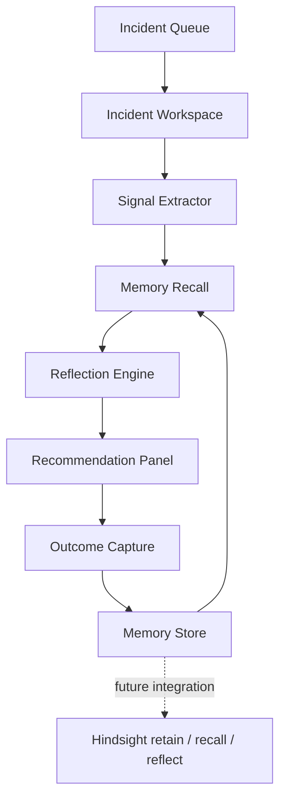

# ReTrace

ReTrace is an incident-response agent that learns from failed fixes.
It was built for **Hack With Hyderabad 3.0** under the theme **AI Agents That Learn Using Hindsight**. The core idea is simple: every resolved incident should make the next investigation better.

## Project Overview

ReTrace is a focused incident-response assistant for engineering and SRE teams. It helps responders avoid repeating fixes that only gave temporary relief in earlier outages.
The MVP uses realistic synthetic incidents to show how memory changes an agent's behavior. A user can open an incident, compare the agent's recommendation with and without memory, inspect the recalled evidence, and retain a new outcome after the investigation.
The project is intentionally scoped to one professional workflow: resolving recurring production incidents. This keeps the demo clear for judges and makes the memory behavior easy to evaluate.

Core workflow:
1. An incident is selected from the incident queue.
2. ReTrace displays service signals such as error rate, retries, queue lag, replica count, or recent changes.
3. The agent checks the current memory bank for relevant past incidents.
4. ReTrace reflects on the recalled evidence before recommending the next investigation step.
5. The user records the outcome so future investigations improve.

## Pitch

Engineering teams often repeat the same temporary fixes during recurring outages because the useful parts of old postmortems are hard to reuse in the middle of an incident.
ReTrace stores what was tried, whether it worked, what actually fixed the issue, and when that lesson applies. During a new incident, it recalls relevant past failures and reflects before suggesting the next action.

## Demo Links

- GitHub repository: `ADD_GITHUB_REPO_LINK`
- Demo video: `ADD_LINKEDIN_VIDEO_LINK`
- Medium article: `ADD_MEDIUM_ARTICLE_LINK`
- Reddit post: `ADD_REDDIT_POST_LINK`

Local demo URLs:
- Main app: `http://localhost:5173`
- Checkout memory demo: `http://localhost:5173/?demo=checkout`
- Stale-fix demo: `http://localhost:5173/?demo=order`

## What It Shows

ReTrace demonstrates a memory-driven incident workflow:

1. A live incident appears with service signals, recent changes, and symptoms.
2. The agent gives a generic recommendation when no memory is available.
3. A previous incident outcome is retained as memory.
4. The agent recalls relevant past failures during a similar incident.
5. The recommendation changes because the agent knows what failed before.
6. The agent warns when an old fix may be unsafe because the system changed.
The strongest demo is the `order-worker` incident. ReTrace remembers that increasing worker concurrency helped once, but now warns that the same fix may be unsafe because replicas were doubled and the provider is returning `429` errors.

## System Architecture

ReTrace is built as a lightweight browser-based MVP with a small Node.js static server. The current implementation keeps memory in browser local storage for reliable demos, while the data model is designed to map directly to Hindsight memory calls.



### Components

| Component | Purpose |
| --- | --- |
| Incident Queue | Lets the user switch between realistic incident scenarios. |
| Incident Workspace | Shows current incident details, affected service, severity, and signals. |
| Memory Store | Stores attempted fixes, outcomes, durable lessons, and applies-when conditions. |
| Recall Logic | Finds relevant memories by comparing saved lessons with current incident symptoms. |
| Reflection Engine | Changes the recommendation based on recalled evidence and changed system context. |
| Recommendation Panel | Shows the next best investigation step with supporting checks. |
| Outcome Capture | Lets the responder retain a new lesson after the incident. |

### Data Flow

1. The selected incident provides symptoms such as `latency`, `database pool`, `replica change`, or `429 errors`.
2. ReTrace scores stored memories against those symptoms.
3. Relevant memories are shown in the memory bank.
4. The reflection engine decides whether to reuse, avoid, or question a remembered fix.
5. The responder records the final outcome.
6. The new memory becomes available for the next incident.

### Memory Record Shape

Each retained memory uses this structure:

```js
{
  incidentTitle: "Order confirmations fail after replica change",
  service: "order-worker",
  attemptedFix: "Increase worker concurrency",
  result: "temporary",
  lesson: "Increasing worker concurrency solved an earlier retry backlog when replicas were low. With more replicas, that same fix can amplify provider rate limits.",
  appliesWhen: "order confirmations retrying, provider 429s, replica count changed"
}
```

## Hindsight Memory Flow
ReTrace is designed around the Hindsight loop:

### Retain

The app stores incident outcomes as structured memory:

- incident title
- affected service
- attempted fix
- result: failed, temporary relief, or resolved
- durable lesson
- applies-when condition
Example:

```text
Attempted fix: Increase worker concurrency
Result: Temporary relief
Lesson: Increasing worker concurrency solved an earlier retry backlog when replicas were low. With more replicas, that same fix can amplify provider rate limits.
Applies when: order confirmations retrying, provider 429s, replica count changed
```

### Recall

When a new incident appears, ReTrace compares the current symptoms against saved lessons and retrieves relevant memories.
Example recalled evidence:

```text
Needs boundary check:
Increase worker concurrency was temporary. With more replicas, that same fix can amplify provider rate limits.
```

### Reflect

The agent uses recalled memory to change its recommendation.

Without memory:

```text
Start with the loudest metric, then try the usual fix.
```

With memory:

```text
Use the old fix as evidence, but verify the changed boundary first.
```

## Why This Fits The Hackathon

The project is built around the hackathon requirement that AI agents should learn using Hindsight.
- Memory is central to the workflow.
- Memory is visible in the UI.
- The demo shows before-and-after behavior.
- The agent improves across interactions.
- The agent does not blindly reuse memory; it checks whether the old fix still applies.

## Features

- Incident dashboard with realistic service signals
- Memory bank for retained lessons
- Before-and-after comparison: no memory vs memory
- Outcome capture form
- Failed-fix tracking
- Stale-fix warning when system context changes
- Local demo mode for reliable judging and video recording

## Tech Stack

- HTML
- CSS
- JavaScript
- Node.js static server
- Browser local storage for MVP memory
The current MVP uses local storage so the demo works without external setup. The memory model maps directly to Hindsight `retain`, `recall`, and `reflect` calls.

## Run Locally

Install Node.js, then run:

```bash
npm start
```

Open:

```text
http://localhost:5173
```

To verify the code:

```bash
npm run check
```

## Demo Script

Use this script for the video or live judging:
This is ReTrace, an incident-response agent that learns from failed fixes.
Without memory, it gives generic incident advice: restart, check deploys, inspect dashboards.
Now ReTrace retains a previous incident outcome. It remembers that a fix gave only temporary relief and records the durable lesson.
With memory on, the first recommendation changes. The agent avoids repeating a temporary fix and checks the real cause earlier.
In the order-worker incident, ReTrace does something more important: it remembers an old fix, but warns that the fix may no longer be safe because replicas changed and the provider is returning rate-limit errors.
That is the core idea: every resolved incident makes the next investigation better.

## Future Scope

- Replace local storage with Hindsight cloud memory
- Add login and team-specific memory banks
- Ingest real logs from incident tools
- Add source citations for every recalled memory
- Track recommendation quality across repeated incident simulations
- Support Slack or PagerDuty incident handoff

## Team

- Team member 1: MOTAMARRI AKHILESH SAI VENKAT HARNATH
- Team member 2: 

## Submission Content
- GitHub README: this file
- Medium article: https://medium.com/@akhileshsai2006/building-retrace-making-incident-memory-useful-during-outages-17235275da56
- Reddit post: (https://www.reddit.com/r/hackathon/s/0if48AbXDu)
